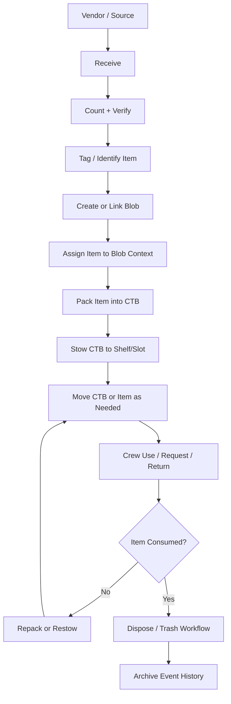
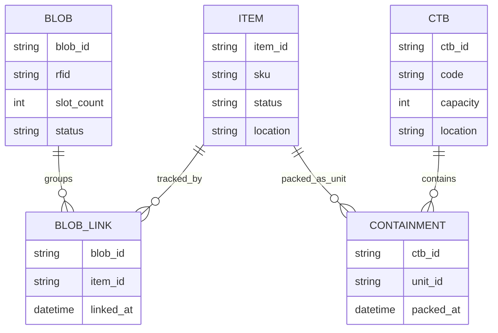

# CTB, Blob, and Item Process Map

This map explains how units move through the system and how entity relationships work.

## Entity Meaning

- `Item`: A physical supply unit (tool, med kit, food pack, etc.).
- `Blob`: A tracked grouping/container context used for scan and slot logic.
- `CTB`: Cargo Transfer Bag used for operational packing/stow/move.

## Core Relationship Model

- Items are the base units being counted, tagged, moved, and consumed.
- Blobs represent grouped tracking state that can reference one or more items.
- CTBs are operational containers that hold items (or nested containers) for transport/stow.

## Process Flow Diagram

## Relationship Diagram

